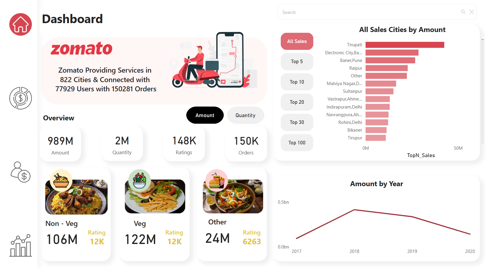

# Zomato City Performance Dashboard

https://github.com/user-attachments/assets/4482d687-4140-424f-a6c1-e371f151b698

## Overview

This project involves a comprehensive data dashboard created for Zomato, focusing on city-level performance metrics. The dashboard provides insights into various aspects such as sales, orders, ratings, gained and lost customers, and user demographics. The primary goal was to analyze and present data in an interactive and visually appealing manner to aid business decision-making and strategic planning.

## Goals

- To provide a detailed overview of Zomato's city-wise performance.
- To visualize data for actionable insights.
- To track user behavior, sales, and ratings for strategic planning.
- To enable stakeholders to understand city-level dynamics.

## Target Audience

This dashboard is designed for Zomato’s internal stakeholders, including:

- Business analysts
- Marketing teams
- Regional managers
- Executive leadership

## Challenges Faced

- **Data Cleaning:** Ensuring that the data was accurate and consistent.
- **Design Optimization:** Balancing detailed information with a user-friendly interface.
- **Performance:** Handling large datasets without impacting responsiveness.
- **Interactivity:** Implementing dynamic features for better user experience.

## Key Features

- **Overview Metrics:** Displays high-level KPIs, including total amount, orders, and ratings.
- **City Performance Analysis:** Breaks down sales, orders, and customer acquisition metrics for each city.
- **User Demographics:** Insights into user activity by age and gender.
- **Visual Highlights:** Bar charts, line graphs, and interactive elements for easy data comprehension.
- **Dynamic Filtering:** Enables users to focus on specific cities or metrics.

## Project Components

### Page 1: Dashboard

- **Overview Section:** Summarizes Zomato’s reach in 822 cities, with 150,281 orders and 77,929 users.
- **Food Category Insights:**
  - **Non-Veg:** 106M sales with 12K ratings.
  - **Veg:** 122M sales with 12M ratings.
  - **Other:** 24M sales with 6,263 ratings.
- **All Sales Cities by Amount:** A bar chart showing top-performing cities, led by Tirupati.
- **Amount by Year:** A line chart showing sales trends from 2017 to 2020.

### Page 2: User Performance

- **Overview Section:** Highlights active users (78K), total user count (100K), ratings (148K), and orders (150K).
- **Customer Metrics:**
  - **Gained Customers:** 12K (6.5K male and 5.1K female).
  - **Lost Customers:** 33K (18.8K male and 14K female).
- **User by Age:** A bar chart showing user distribution by age groups, with the 19-25 age group being the most active.

### Page 3: City Performance

- **Overview Section:** Displays total amount (989M), quantity (2M), ratings (148K), and orders (150K) across all cities.
- **Table:** Provides city-wise details for sales, orders, and gained customers.
- **Charts:**
  - **Sale Value by City:** Highlights top-performing cities in terms of sales, with Tirupati leading.
  - **Rating Count by City:** Displays the number of ratings per city, with Bikaner at the top.
  - **Active Users by City:** Visualizes user activity levels by city, showing Bikaner and "Other" as the most active.

## Insights

1. **Top-Performing Cities:** Tirupati leads in sales, followed by Electronic City and Baner.
2. **Rating Engagement:** Bikaner receives the highest ratings, indicating strong customer interaction.
3. **User Demographics:** The majority of active users fall in the 19-25 age range, highlighting a young customer base.
4. **Lost vs. Gained Customers:** A significant number of customers were lost, which may require targeted retention strategies.
5. **Category Performance:** Veg items outperform Non-Veg in terms of sales volume.

## Final Result

The Zomato City Performance Dashboard successfully provides actionable insights into city-level operations. It helps Zomato identify high-performing cities, understand user demographics, and strategize improvements in customer retention and service quality. The dashboard serves as a critical tool for informed decision-making, driving business growth and operational efficiency.

